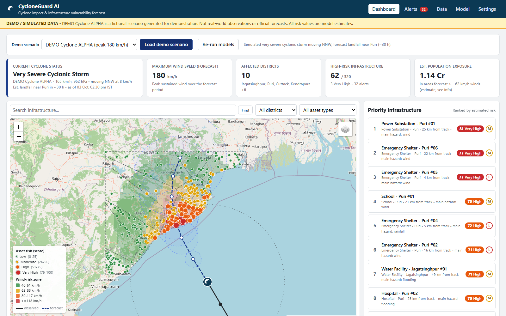

# CycloneGuard AI

**Track-based cyclone impact & infrastructure vulnerability forecast**

CycloneGuard AI turns a cyclone track (observed and forecast) into an explainable, prioritised list of infrastructure at risk, with preparedness recommendations. It's built for disaster management authorities, district and municipal administrations, emergency responders, infrastructure operators, and NGOs.

> ⚠️ **Prototype.** Every output is a **model estimate with stated confidence**, not an observation or an official forecast.
> Demo mode uses **simulated data** and is labelled **DEMO / SIMULATED DATA** throughout. Always follow official IMD / SDMA advisories.



---

## 1. Problem statement

When a cyclone approaches, officials must quickly decide which substations, hospitals, bridges, towers, shelters, and roads need attention first. They need to know where impacts are likely, which assets are most vulnerable, what kind of impact to expect, and how certain that picture is. In practice, track forecasts, hazard maps, and asset inventories sit in separate places, and turning them into a ranked, defensible action list is slow and mostly manual.

## 2. Solution

CycloneGuard AI chains these steps into one pipeline:

```
Cyclone track → Weather → Geospatial → Infrastructure → Validation & preprocessing
→ Model A: cyclone impact → Model B: infrastructure vulnerability → Risk scoring engine
→ Geospatial risk map → Priority infrastructure list → Alerts & preparedness recommendations
```

For each asset, it answers:

1. Where will the cyclone likely have an effect?
2. How high is the risk?
3. Which hazard dominates?
4. Why is the risk at this level?
5. How confident is the estimate?
6. What should be prepared?

## 3. Features

- **Interactive map** built with Leaflet on an OpenStreetMap basemap. It shows:
  - the predicted track with an uncertainty cone, and the observed (historical) track
  - estimated landfall
  - wind, rainfall, flood, and storm-surge risk zones
  - infrastructure assets coloured by risk
  - a vulnerability heatmap
  - schematic district zones, rivers, and coastline
  - CARTO and Esri satellite basemaps

  You can zoom, pan, toggle layers, select assets, search, and filter by district or asset type.
- **Dashboard**:
  - cards for cyclone status, maximum wind, affected districts, high-risk infrastructure, and estimated population exposure
  - a priority infrastructure list
  - charts for risk distribution, risk by asset type, hazard contribution, district statistics, and the intensity timeline
- **Asset detail**:
  - score with an uncertainty band and category
  - confidence and its components
  - predicted hazards and distance from the track
  - wind and flood exposure, and criticality
  - score composition, main risk factors, and Model B attribution
  - preparedness checklist that you can copy or print
- **Rule-based alerts** with severities and acknowledgements. The rules are transparent, and the wording never claims that damage will happen.
- **CSV and GeoJSON upload** with per-row validation and rejection reasons. Geographic features are derived automatically.
- **Configurable** weights, thresholds, hazard gate, and minimum alert confidence, set from the Settings page.
- **Demo mode** with three simulated scenarios: ALPHA (VSCS, Puri), BRAVO (SCS, Dhamra), and CHARLIE (CS, Gopalpur).
- **Live-data interfaces**: a cyclone JSON feed and Open-Meteo NWP rainfall, both with graceful fallback to demo data.

## 4. Architecture

| Layer | Stack |
|---|---|
| Frontend | React 19 + TypeScript, Vite, react-leaflet, Recharts |
| Backend | Python, FastAPI, SQLAlchemy 2, pydantic v2 |
| ML | NumPy, pandas, scikit-learn (RandomForest; optional XGBoost) |
| Database | SQLite (development fallback) / PostgreSQL + PostGIS (Docker) |
| Deployment | Docker Compose: PostGIS, backend, and nginx-served frontend |

```
cycloneguard-ai/
├── frontend/     React app (src/api, components, pages, context, hooks)
├── backend/      FastAPI app (api/, services/, providers/, geodata/, models.py, schemas.py)
├── ml/           Model A, Model B, risk scoring, training (no web/DB dependencies)
├── data/         samples/ (upload & track examples), demo_export/ (simulated dataset), SQLite DB
├── models/       trained vulnerability model (+ metadata JSON), created by `python -m ml.train`
├── scripts/      seed_demo.py, run_dev.ps1/.sh, screenshot/demo_flow.mjs
├── tests/        pytest suite (88 tests)
├── docs/         architecture.md, api.md, model.md, demo_script.md, screenshots/
├── docker/       Dockerfiles, nginx.conf, postgres init + PostGIS upgrade
├── .env.example
└── docker-compose.yml
```

See [docs/architecture.md](docs/architecture.md) for the pipeline, database, and security design.

## 5. AI/ML approach

- **Model A, cyclone impact.** A physics-informed parametric model:
  - Rankine-vortex wind with right-side asymmetry
  - an intensity-scaled rain-rate profile integrated hourly along the track
  - a logistic flood probability combining rainfall with terrain susceptibility
  - a storm-surge exposure index based on intensity, proximity, coast distance, and elevation

  It's transparent, it needs no training data, and every coefficient is documented.
- **Model B, infrastructure vulnerability.** A RandomForest that estimates the probability of significant damage or disruption. Its inputs are distance from the track, wind, rainfall, elevation, coast distance, flood and surge exposure, asset type, age (missing values imputed and flagged), and historical damage.

  Model B is **trained on synthetic fragility-curve data** because no labelled asset-level damage dataset was available. Its metrics show fit to that assumed process, not real-world skill. It sits behind a `VulnerabilityModel` interface, so a model trained on real damage records can replace it.
- **Risk score (0–100)**, built transparently from weighted components:

  ```
  Risk = 100 × (0.40·Hazard + 0.30·Vulnerability + 0.20·Environment·g + 0.10·Criticality·g) / Σw
  ```

  The categories are 0–25 Low, 26–50 Moderate, 51–75 High, and 76–100 Very High. Weights and thresholds are configurable **prototype assumptions**.

  The hazard gate `g` ensures that critical, low-lying assets far from the storm don't score high on their own.
- **Confidence** is a heuristic that combines four signals:
  - track-forecast uncertainty at closest approach
  - model agreement (spread across trees)
  - data completeness
  - lead time
- **Explainability** comes from three sources:
  - the exact points each component contributes
  - plain-language factors, for example "18 km from predicted cyclone track" or "Low elevation (2.1 m)"
  - Model B occlusion attribution

Full details are in [docs/model.md](docs/model.md).

## 6. Dataset structure

**Infrastructure upload (CSV)**:

```csv
name,asset_type,lat,lon,district,elevation_m,age_years,historical_damage_count,criticality,capacity
Puri Grid Substation,power_substation,19.812,85.815,Puri,3.5,28,2,,132/33 kV
```

- **Required:** `name`, `asset_type`, `lat`, `lon`.
- **Optional:** everything else. If elevation, slope, coast and river distance, flood zone, or district are missing, they're derived from the study-region GIS layers and flagged.
- **GeoJSON:** a FeatureCollection with Point, LineString, or Polygon geometries and the same properties.
- **Examples:** see `data/samples/`.

**Cyclone track** (`POST /api/cyclones`, also the live-feed format):

```json
{"name": "...", "points": [{"time": "2026-10-01T00:00:00Z", "lat": 16.5, "lon": 87.5, "wind_kmh": 90,
  "pressure_hpa": 988, "is_forecast": false}]}
```

The optional fields are `rmw_km`, `roi_km`, and `uncertainty_km`. See `data/samples/sample_cyclone_track.json`.

**Demo dataset** (simulated): `data/demo_export/` contains the infrastructure inventory (CSV and GeoJSON), the ALPHA track, and risk predictions. Regenerate it with `python scripts/seed_demo.py --export data/demo_export`.

**Study-region reference data.** The demo region is the Odisha coast. The coastline, rivers, and flood-prone zones are **simplified, hand-digitised approximations**. District zones are **schematic** Voronoi cells around district headquarters, clipped to land, and are **not official boundaries**. District populations are Census 2011 figures. The **DEM is synthetic**.

## 7. Installation

Prerequisites: Python 3.11+ (tested on 3.13), Node.js 20+ (tested on 24), npm.

```powershell
# from the repository root
python -m venv .venv
.\.venv\Scripts\python.exe -m pip install -r backend\requirements.txt     # Linux/macOS: .venv/bin/pip install -r backend/requirements.txt
.\.venv\Scripts\python.exe -m ml.train                                    # trains the model in ~1 s (also auto-trained on first start)
cd frontend; npm install; cd ..
copy .env.example .env                                                    # optional
```

> On Windows with **Smart App Control / Application Control** enabled, the newest numpy, scipy, scikit-learn, and SQLAlchemy wheels may be blocked. `requirements.txt` therefore pins widely distributed versions that load correctly.

## 8. Running locally

Use two terminals, both started from the repository root:

```powershell
# Terminal 1 - backend API on http://localhost:8000  (Swagger UI: http://localhost:8000/docs)
.\.venv\Scripts\python.exe -m uvicorn backend.app.main:app --reload --port 8000

# Terminal 2 - frontend on http://localhost:5173  (proxies /api to :8000)
cd frontend
npm run dev
```

Alternatively, `scripts\run_dev.ps1` (Windows) or `scripts/run_dev.sh` (Linux/macOS) starts both.

On first start, the backend creates `data/cycloneguard.db` (SQLite) and seeds **DEMO Cyclone ALPHA**.

**Tests**:

```powershell
.\.venv\Scripts\python.exe -m pytest          # 88 tests: scoring, models, API, uploads, invalid/missing data, alerts, auth
cd frontend; npm run build                     # type-check + production build
```

**Docker (PostgreSQL + PostGIS)**:

```bash
cp .env.example .env            # set POSTGRES_PASSWORD (and ADMIN_API_KEY if you want auth)
docker compose up --build
# frontend: http://localhost:8080   API: http://localhost:8000/docs
# optional spatial columns/indexes:
docker compose exec db psql -U cycloneguard -d cycloneguard -f /opt/postgis_upgrade.sql
```

**Screenshots and an end-to-end UI check.** With both servers running, this walks the demo in a real browser (it uses installed Edge or Chrome) and fails on any console error:

```powershell
cd scripts\screenshot; npm install; node demo_flow.mjs
```

## 9. API documentation

The full reference is in [docs/api.md](docs/api.md), and the interactive OpenAPI docs are at `/docs`. The main endpoints:

```
GET  /api/cyclone/current        GET  /api/cyclone/track          POST /api/cyclones
POST /api/infrastructure/upload  GET  /api/infrastructure         GET  /api/risk/map
GET  /api/risk/priority          GET  /api/risk/{asset_id}        POST /api/predict
GET  /api/alerts                 GET  /api/statistics             POST /api/demo/generate
GET/PUT /api/settings/risk       GET  /api/model/info             GET  /api/data-sources
```

**Auth:** set `ADMIN_API_KEY` to require the `X-API-Key` header on mutating endpoints. Enter the key in the UI on the Settings page; it's stored in session storage only, never in the bundle.

## 10. Demo mode

- **Load a scenario:** pick one in the **Demo scenario** bar and click **Load demo scenario**. You can also call `POST /api/demo/generate {"scenario": "alpha|bravo|charlie"}` or run `python scripts/seed_demo.py --scenario bravo`.
- **What gets generated:**
  - a track with intensity, pressure, IMD category, radii, and a forecast-uncertainty cone
  - simulated weather stations
  - about 320 infrastructure assets of 9 types, with elevation and vulnerability features
- **Labelling:** everything generated is flagged `is_demo` and labelled in the API and UI.
- **Isolation:** simulated station readings are display-only and never feed back into the models.
- **3-minute walkthrough:** see [docs/demo_script.md](docs/demo_script.md). It covers opening the dashboard, selecting a scenario, the track, the affected region, the vulnerability map, a high-risk asset with its explanation, the priority list, recommendations, and confidence.

**Live data.**

- `CYCLONE_FEED_URL` enables `POST /api/cyclone/import-live`.
- `WEATHER_PROVIDER=openmeteo` enables `POST /api/weather/refresh`, which pulls real 72-hour NWP rainfall and blends it into Model A.
- If a provider is unset or unreachable, the API returns a clear fallback message and keeps using the existing or demo data.
- A satellite imagery basemap is available. Satellite analytics exist as an interface only.

## 11. Model explanation (example)

> **Power Substation – Puri #01**: Risk **81 / 100, Very High** (±7.6), *Medium confidence (62%)*
> Main contributing factors: high predicted wind exposure (~159 km/h peak) · heavy rainfall expected (~376 mm) · 25 km from predicted cyclone track · high flood exposure (82%) · critical infrastructure category · low elevation (5.7 m).
> Composition: hazard 37.0 + vulnerability 26.9 + environment 7.3 + criticality 9.5 = 80.7 points.
> Recommended (guidance): inspect critical equipment; prepare backup power; review emergency access; protect equipment from flooding.

Exact values depend on the scenario seed and settings.

## 12. Limitations and future improvements

**Current limitations:**

- Model B is trained on synthetic labels.
- Model A is a simplified parametric model; it isn't hydrodynamic surge modelling or NWP.
- The demo geography and DEM are approximate or synthetic.
- Confidence values are indicators, not calibrated probabilities.

**Planned improvements:**

- Train Model B on historical post-event damage data, for example Fani 2019, Amphan 2020, and Yaas 2021 damage assessments, plus utility outage records.
- Ingest IMD/RSMC track bulletins and ensemble forecasts, and run Monte-Carlo risk for calibrated intervals.
- Use a real DEM (SRTM/Copernicus), OSM/Bhuvan infrastructure, and official boundaries.
- Model cascading failures across dependent networks, for example power to water, telecom, and hospitals.
- Assess post-event damage from Sentinel-1/2 satellite imagery (STAC interface).
- Add SMS and WhatsApp alert dissemination, role-based access (OAuth2), and audit logs.
- Support Hindi and Odia in the user interface.
